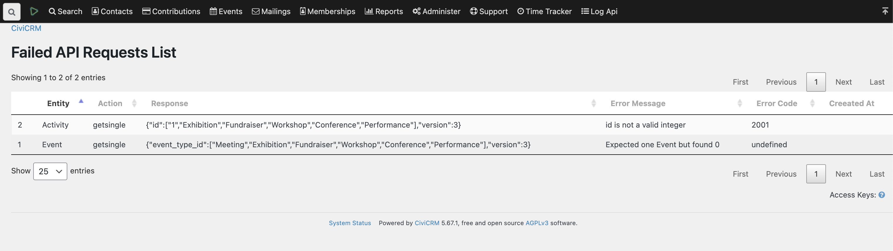

# com.agiliway.logapi



The extension structured as follows:

Config: Allow to define which requests should be logged, for now it's can be filtered by keywords, entity and action. If
config not set, then log all failed requests, regardless of the API endpoint.
Log storage: For now support a simple table with
entity/action/response/errorCode/errorMessage/apiVersion/user/createdTime

The extension is licensed under [AGPL-3.0](LICENSE.txt).

## Requirements

* PHP v7.4+

## Installation (Web UI)

Learn more about installing CiviCRM extensions in
the [CiviCRM Sysadmin Guide](https://docs.civicrm.org/sysadmin/en/latest/customize/extensions/).

## Installation (CLI, Zip)

Sysadmins and developers may download the `.zip` file for this extension and
install it with the command-line tool [cv](https://github.com/civicrm/cv).

```bash
cd <extension-dir>
cv dl com.agiliway.logapi@https://github.com/FIXME/com.agiliway.logapi/archive/master.zip
```

or

```bash
cd <extension-dir>
cv dl com.agiliway.logapi@https://lab.civicrm.org/extensions/com.agiliway.logapi/-/archive/main/com.agiliway.logapi-main.zip
```

## Installation (CLI, Git)

Sysadmins and developers may clone the [Git](https://en.wikipedia.org/wiki/Git) repo for this extension and
install it with the command-line tool [cv](https://github.com/civicrm/cv).

```bash
git clone https://github.com/FIXME/com.agiliway.logapi.git
cv en logapi
```

or

```bash
git clone https://lab.civicrm.org/extensions/com.agiliway.logapi.git
cv en logapi
```